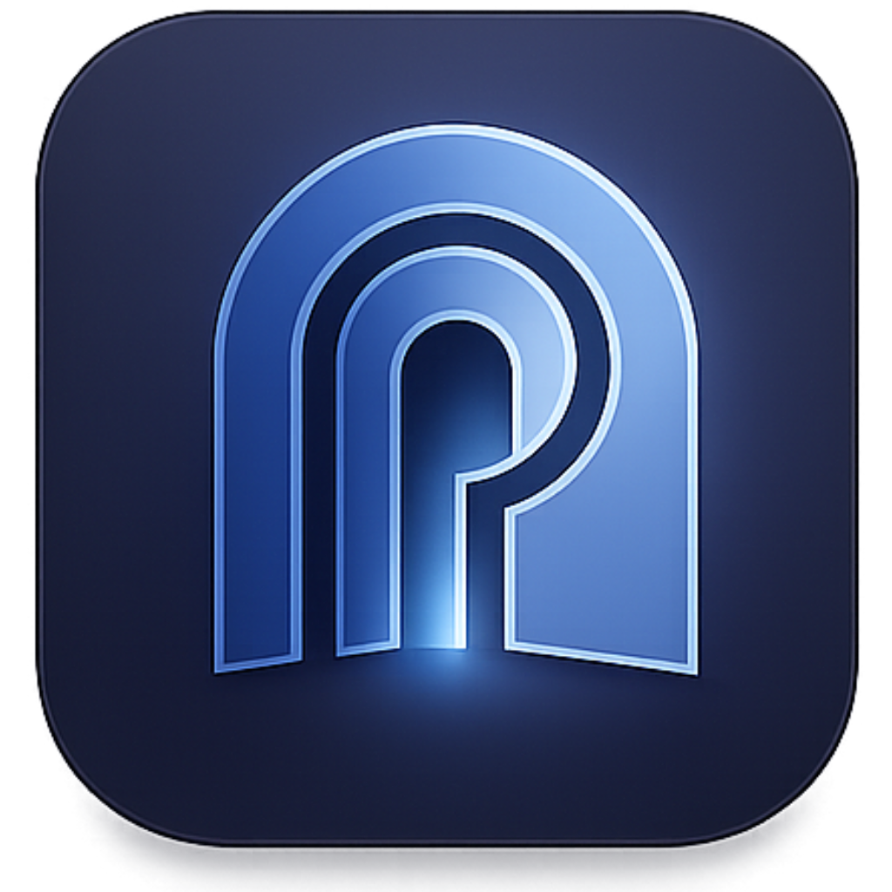

<p align="center">
  
</p>

<h1 align="center">Portus</h1>

<p align="center"><strong>Secure SSM &amp; RDP-over-SSM access for AWS instances.</strong></p>

Portus is a cross-platform desktop app (Electron) that lets you authenticate to AWS
with Azure AD SSO, browse your EC2 instances, and open a **Systems Manager (SSM)
shell** or a **RDP-over-SSM tunnel** to any instance — with no inbound ports, no
bastion hosts, and no manual CLI commands.

> Open source, released under the MIT License.

---

## Table of Contents

1. [Features](#features)
2. [How it works](#how-it-works)
3. [Prerequisites](#prerequisites)
4. [AWS profile configuration](#aws-profile-configuration)
5. [Installation](#installation)
6. [Running the app (development)](#running-the-app-development)
7. [Building installers](#building-installers)
8. [Project structure](#project-structure)
9. [Branding / icons](#branding--icons)
10. [Troubleshooting](#troubleshooting)
11. [Tech stack](#tech-stack)

---

## Features

- **Azure AD SSO login** via `aws-azure-login`
- **EC2 instance browser** — live list per profile/region, searchable
- **One-click SSM shell** — opens `aws ssm start-session` in a new terminal window
- **RDP over SSM** — auto port-forward tunnel + launches your RDP client (Windows-only instances)
- Smart buttons: SSM on any running instance, RDP only on running Windows instances
- Cross-platform: Windows, macOS, Linux

---

## How it works

```
1. SSO Connect      → pick an Azure AD profile → runs aws-azure-login
2. Select Profile   → choose an operational AWS profile (loads its EC2 instances)
3. Connect          → click SSM (shell) or RDP (tunnel) on an instance row
```

Under the hood the app shells out to the **AWS CLI** (`aws ssm start-session`) and the
**Session Manager plugin**, so those must be installed (see prerequisites).

---

## Prerequisites

### Build / development machine

| Requirement | Version | Why | Install |
|-------------|---------|-----|---------|
| **Node.js** | 18 LTS or newer | Run & build the app | <https://nodejs.org> |
| **npm** | comes with Node | Dependency management | (bundled with Node) |
| **Git** | any recent | Clone the repo | <https://git-scm.com> |
| **Python** (macOS builds only) | 3.11 | Some native build deps (`dmg-license`) | <https://python.org> |

### Runtime (needed on any machine that *uses* the app)

These are external tools Portus calls at runtime. The app will show an error toast if
one is missing.

| Tool | Why | Install |
|------|-----|---------|
| **AWS CLI v2** | Runs `aws ssm start-session` for SSM & RDP | <https://docs.aws.amazon.com/cli/latest/userguide/getting-started-install.html> |
| **AWS Session Manager plugin** | Required by `aws ssm start-session` | <https://docs.aws.amazon.com/systems-manager/latest/userguide/session-manager-working-with-install-plugin.html> |
| **aws-azure-login** | Azure AD SSO authentication | `npm install -g aws-azure-login` |
| **RDP client** | Needed only for RDP-over-SSM | Windows: `mstsc` (built-in) · macOS: [Microsoft Remote Desktop](https://apps.apple.com/app/microsoft-remote-desktop/id1295203466) · Linux: `remmina`, `xfreerdp`, or `rdesktop` |

### AWS-side requirements (per target instance)

- Instance has the **SSM Agent** installed and running
- Instance has an **IAM role** with SSM permissions (`AmazonSSMManagedInstanceCore`)
- Instance can reach SSM endpoints (NAT/VPC endpoints)
- For **RDP**: the instance is **Windows** and running

---

## AWS profile configuration

Portus reads your standard AWS config at `~/.aws/config` (and `~/.aws/credentials`).
It splits profiles into two groups:

- **SSO profiles** — contain `azure_*` fields → shown in the "SSO Connect" dialog
- **Operational profiles** — everything else → shown in the top-bar profile dropdown

Example `~/.aws/config`:

```ini
# --- Azure AD SSO profile (used for "SSO Connect") ---
[profile my-sso]
azure_tenant_id = 00000000-0000-0000-0000-000000000000
azure_app_id_uri = https://signin.aws.amazon.com/saml
azure_default_username = you@company.com
azure_default_role_arn = arn:aws:iam::123456789012:role/YourRole
region = me-central-1

# --- Operational profile (used to list instances & connect) ---
[profile my-account]
region = me-central-1
# credentials populated by aws-azure-login after SSO, or static keys, etc.
```

> Tip: `aws-azure-login --profile my-sso` should work from your terminal before you
> rely on it in the app.

---

## Installation

```bash
# 1. Clone
git clone https://github.com/khaledk95/portus.git
cd portus

# 2. Install dependencies (runs electron-builder install-app-deps via postinstall)
npm install
```

That's it — no `.env` or extra config files are required to run the app.

---

## Running the app (development)

```bash
# Normal launch
npm start

# Launch with DevTools open
npm run dev
```

The window opens on a welcome screen. Click **SSO Connect**, authenticate, pick an
operational profile, and your instances load automatically.

---

## Building installers

All builds output to the `dist/` folder (git-ignored).

| Command | Output |
|---------|--------|
| `npm run build:win64` | Windows x64 — NSIS installer + portable `.exe` |
| `npm run build:win32` | Windows 32-bit (ia32) |
| `npm run build:win` | Windows (all configured arches) |
| `npm run build:mac` | macOS `.dmg` (x64 + arm64) |
| `npm run build:mac-intel` | macOS Intel only |
| `npm run build:mac-silicon` | macOS Apple Silicon only |
| `npm run build:linux` | Linux AppImage / deb / rpm / tar.gz |
| `npm run build:all` | All platforms (mac builds require macOS) |
| `npm run pack` | Unpacked dir only (fast, for testing) |
| `npm run dist` | Build without publishing |

**Notes**
- Build each OS on its own platform where possible. macOS `.dmg` and `.icns`
  generation require running on macOS.
- macOS builds are produced **unsigned** (no Apple Developer cert configured).
- A GitHub Actions workflow (`.github/workflows/build-macos.yml`) builds the macOS
  app on demand (`workflow_dispatch`).

---

## Project structure

```
.
├── src/
│   ├── main.js          # Electron main process — IPC handlers, AWS SDK, CLI spawns
│   ├── preload.js       # contextBridge — exposes the safe electronAPI to the renderer
│   ├── renderer.js      # UI logic (AWSManager class): login, instances, connect
│   ├── index.html       # App markup
│   ├── styles.css        # Glassmorphism theme (graphite + steel blue)
│   └── assets/
│       └── portus.png   # In-app logo
├── build/
│   ├── portus.png       # Source icon (macOS/Linux; electron-builder generates sizes)
│   └── portus.ico       # Multi-size Windows icon (16–256 px)
├── .github/workflows/
│   └── build-macos.yml  # CI: on-demand macOS build
├── package.json         # Scripts + electron-builder config
└── README.md
```

**Architecture:** standard Electron 3-process model. The renderer never touches Node
or AWS directly — it calls `window.electronAPI.*`, which forwards over IPC to handlers
in `main.js`. `contextIsolation` is on and `nodeIntegration` is off.

---

## Branding / icons

- In-app logo: `src/assets/portus.png`
- App/installer icons: `build/portus.png` (mac/linux) and `build/portus.ico` (Windows, multi-size)

To change the icon, replace those files (keep `portus.ico` multi-size: 16/24/32/48/64/128/256).
If a Windows icon still looks stale after rebuilding, clear the Windows icon cache:

```powershell
ie4uinit.exe -show
```

---

## Troubleshooting

| Symptom | Cause / fix |
|---------|-------------|
| `aws-azure-login command not found` | `npm install -g aws-azure-login`, then restart the app |
| SSM session window opens then closes / errors | AWS CLI v2 and/or **Session Manager plugin** not installed, or instance has no SSM agent/IAM role |
| `AWS CLI not found` | Install AWS CLI v2 and ensure it's on your `PATH` |
| RDP button missing on an instance | RDP only appears for **running Windows** instances |
| RDP client doesn't launch | Windows: ensure `mstsc` available · macOS: install Microsoft Remote Desktop · Linux: install `remmina`/`xfreerdp`/`rdesktop` |
| No profiles in the SSO dialog | No `azure_*` profiles found in `~/.aws/config` |
| No operational profiles in dropdown | Add a non-Azure profile to `~/.aws/config` |
| App icon not updating (Windows) | Stale icon cache — run `ie4uinit.exe -show` or reinstall to a new path |

---

## Tech stack

- **Electron 37** (electron-builder 24 for packaging)
- **AWS SDK v3** — `@aws-sdk/client-ec2`, `@aws-sdk/credential-providers`
- `fs-extra`, `ini` (read `~/.aws` config)
- External CLIs at runtime: **AWS CLI v2**, **Session Manager plugin**, **aws-azure-login**

---

Released under the [MIT License](LICENSE).
